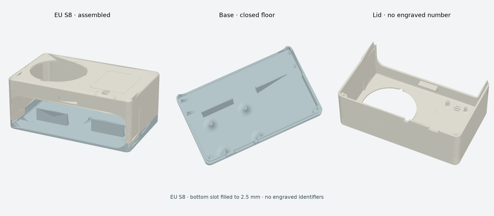

# European speaker enclosure · EU S8

Reusable enclosure for the European EL001 speaker variant, based on the S7 full-box print that Dan reported was great on 15 September 2026. S8 closes the small bottom opening and removes all engraved identifiers. The source and filenames carry the revision; the physical parts have no numbers.



## Files

| Purpose | File |
| --- | --- |
| Editable assembled enclosure | [assembly.step](exports/assembly.step) |
| Separate solids in assembly coordinates | [base.step](exports/base.step), [lid.step](exports/lid.step) |
| Solids oriented for printing | [base-print.step](exports/base-print.step), [lid-print.step](exports/lid-print.step) |
| Matching print meshes | [base-print.stl](exports/base-print.stl), [lid-print.stl](exports/lid-print.stl) |
| Parametric CAD | [source/build.py](source/build.py), [source/front.py](source/front.py), [parameters.json](parameters.json), [rear-sketches.json](rear-sketches.json) |

Use the two `*-print` parts for slicing in millimeters. The base floor and lid roof lie on Z=0; the lid interior faces upward. `assembly.step` is a review assembly, not a third printable part. Material: PLA. Slice for the actual printer and inspect the toolpath before printing; no machine-specific G-code is included.

## Change from S7

The floor opening between the rear speaker supports is filled over X=-7.5…6.5, Y=-25.9…-13, Z=0…2.5 mm: **14 × 12.9 × 2.5 mm**. The cable recess above the floor remains. The only other added material fills the old engravings. A solid difference check found no removed material and no additions outside those regions ([comparison](verification/s7-comparison.json)).

S7's B pocket depth of 37.2 mm, 30 mm central top support, integrated front lip, 0.8 mm front transition, mounting features and lid/base joint are retained. Nominal base size is 197 × 120 × 22.5 mm; lid size is 197.5 × 120 × 74.5 mm, with an assembled height of 82 mm. The existing lid width compensation is intentional and unchanged.

## Rebuild

Run from this directory with Python 3.11 or 3.12:

```sh
python3 -m venv .venv
.venv/bin/python -m pip install -r requirements.txt
.venv/bin/python source/build.py
```

The build regenerates STEP, print STL and [geometry checks](verification/geometry.json). CadQuery constructs analytic solids from dimensions and line/arc profiles; it does not wrap an STL mesh in STEP. The rear sketch profiles retain the earlier recovered outline. They are editable geometric data; some rear dimensions remain directly in `build.py`.

Axes: X across the front, negative Y toward the speaker, Z upward from the base underside. The speaker reference is used for fit checks and is not exported as a printable part. The measured speaker front is 187 × 56 mm, rear 186 × 54 mm and total depth including grille 37.5 mm. R16 corners and the taper remain modeling assumptions; see the evidence entries in `parameters.json`.

The build checks one valid solid per part, STEP round trips, watertight connected print meshes, and nominal speaker/lid/base intersections at eight positions including closed. STL chord tolerance is 0.001 mm and angular tolerance 0.03 rad; only zero-area triangles are removed before checking topology. STEP geometry is authoritative. STEP headers and ordering may differ between runs, so the recorded hashes identify this export rather than promise byte-identical regeneration.

The separate [reference assembly audit](verification/reference-assembly.json) covers 41 objects and 820 closed-pose pairs plus seven lifted-lid positions. It records intended contacts and approximate component/cable overlaps; it is not an all-clear for the physical assembly. Third-party/reference component meshes are not bundled, so that historical audit is not reproduced by `build.py`. Cable routing, button travel, fastener engagement, continuous assembly paths and the new floor still need physical verification. S7's positive print feedback does not establish S8 physical acceptance.
